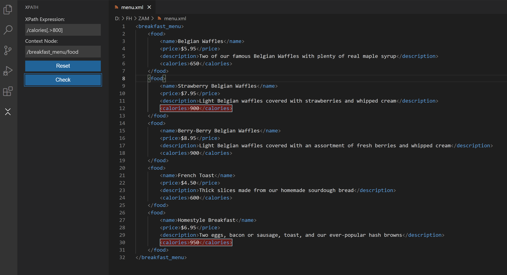

# XPath Tester README

This extension allows you to evaluate simple XPath expressions on the currently opened document. All matches are highlighted.

## Features

Current features include:

- Search for XPath expressions in an XML document and highlight the results
- Print information about the result to a seperate output log
- Customize the look of the extension

## Settings

There are a few settings which allow you to customize the look of the extension. You can find them under Settings > Extension > XPath Tester.
For information about valid values for each setting please refer to the [vscode api reference](https://code.visualstudio.com/api/references/vscode-api#DecorationRenderOptions).

Default values are:

- Border Style: **solid**
- Border Width: **1px**
- Dark Theme Background Color: **#FF000055**
- Dark Theme Border Color: **darkblue**
- Dark Theme Overview Ruler Color: **lightblue**
- Light Theme Background Color: **#0022FF55**
- Light Theme Border Color: **darkblue**
- Light Theme Overview Ruler Color: **darkblue**

**Please reload/restart the extension in order for changes to take effect!**

## How to run locally

1. clone repo
2. run 'npm install' to install dependencies
3. run 'npm run watch' to compile the extension
4. press 'F5' to run the extension

## Release Notes

Please refert to the [changelog](CHANGELOG.md)

## Future plans

- add tests
- finish input validation/improve error handling
- add some examples on how to use

## Thanks

- thanks to the contributors of the [xpath](https://github.com/goto100/xpath) and [xmldom](https://github.com/xmldom/xmldom) projects which are used for this extension
- thanks to [Ben Awad](https://github.com/benawad) for his tutorial on how to write VSCode extensions. you can check it out here: https://www.youtube.com/watch?v=a5DX5pQ9p5M&t
